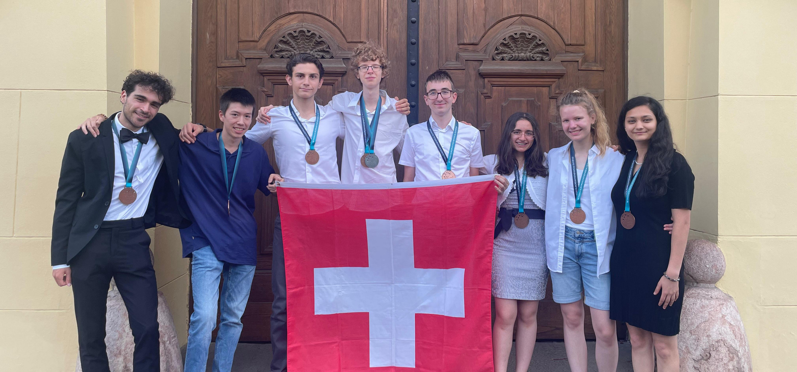
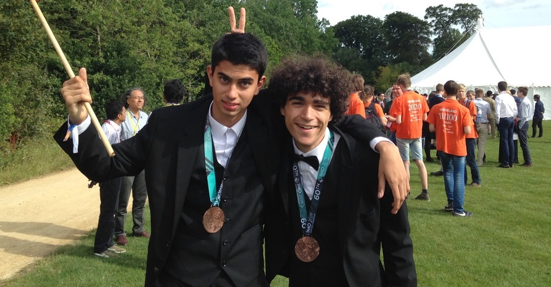

I am the **Academic Director** of the [Swiss Mathematical Olympiad](https://mathematical.olympiad.ch/en/),
a national mathematics competition for high school students. The primary purpose of the competition is to select a
delegation to represent Switzerland at the [International Mathematical Olympiad (IMO)](https://www.imo-official.org/)
and the [Middle European Mathematical Olympiad (MEMO)](https://www.memo-official.org/MEMO/contests/previous/).

Our agenda includes several rounds of competition, numerous preparation meetings, a training weekend,
and a week-long camp for finalists, followed by many more events for those who qualify for international events.
The topics covered differ vastly from the school curriculum, focusing on logical thinking, creative problem-solving,
and proof-writing. Every year, the Olympiad provides a platform for young people from all over Switzerland to interact
and compete with like-minded peers, all while learning new mathematics.

Together with other volunteers, I create, supervise and correct exams, write teaching material,
organise and implement training camps, and lead the best students to international competitions every year.
One of my main contributions is the creation of [original problems](/portfolio.html) for the Swiss Mathematical Olympiad
and various international contests.

The Swiss Mathematical Olympiad is part of a larger network of [Swiss Science Olympiads](https://science.olympiad.ch/en/).

<figure>
    
    <figcaption>Figure 1: Leading the Swiss Team to glory at MEMO 2024</figcaption>
</figure>

### Roles at International Olympiads
I've been involved at many international mathematics competitions and plan to attend many more.
- **Team Leader Liechtenstein** at the IMO 2025 in Australia
- **Coordinator\*** at the Pan African Mathematics Olympiad 2024
- **Team Leader Switzerland** at MEMO 2024 in Hungary
- **Coordinator** at IMO 2024 in England
- **Team Leader Liechtenstein** at the IMO 2023 in Japan
- **Coordinator** at the European Girls' Mathematical Olympiad 2023 in Slovenia
- **Coordinator** at MEMO 2022 in Switzerland
- **Problem Selection Committee** at MEMO 2022 in Switzerland
- **Team Leader Liechtenstein** at IMO 2022 in Norway
- **Team Leader Liechtenstein\*** at IMO 2021
- **Coordinator\*** at the Olympiade Francophone de Mathématiques 2021
- **Deputy Leader Switzerland\*** at MEMO 2020
- **Team Leader Switzerland\*** at the Cyberspace Mathematical Competition 2020
- **Main Organiser\*** of the Global Quarantine Mathematical Olympiad 2020

\*remote participation

I have also been involved in many international training events, giving lectures to the IMO delegations from Switzerland,
Liechtenstein, Austria, Germany, Slovenia, Costa Rica and Kenya.

### Awards

During my high school days, I myself participated very successfully in many mathematical competitions. 
- **Bronze Medal** (73%) at IMO 2019 in England
- **Gold Medal** at the Swiss Mathematical Olympiad 2019
- **Bronze Medal** (68%) at IMO 2018 in Romania
- **Silver Medal** at the Benelux Mathematical Olympiad 2018 in Luxembourg
- **Gold Medal** at the Swiss Mathematical Kangaroo Contest 2018
- **Gold Medal** at the Swiss Mathematical Olympiad 2018
- **Honourable Mention** (32%) at IMO 2017 in Brazil
- **Gold Medal** at the Swiss Mathematical Kangaroo Contest 2017
- **Gold Medal** at the Swiss Mathematical Olympiad 2017
- **Gold Medal** at the Swiss PANGEA Mathematical Contest 2016
- **Gold Medal** at the Swiss PANGEA Mathematical Contest 2015

A detailed breakdown of my performance at the International Mathematical Olympiad can be found
on [imo-official](https://www.imo-official.org/participant_r.aspx?id=27554).
Besides the Swiss Mathematical Olympiad, I participated in various other training programs for mathematics competitions,
including the [UZH Junior Euler Society](https://jes.math.uzh.ch/home) and
the [ETH Youth Academy](https://educ.ethz.ch/lernzentren/mint-lernzentrum/ETH_Youth_Academy.html).

<figure>
    
    <figcaption>Figure 1: Almost Gold</figcaption>
</figure>

I also participated in some other science Olympiads, most notable
the [International Olympiad in Informatics](https://ioinformatics.org/) (IOI).
- **Participation** (21%) at IOI 2019 in Azerbaijan
- **Gold Medal** at the Swiss Olympiad in Informatics 2019
- **Bronze Medal** at the Swiss Philosophy Olympiad 2019
- **Participation** (31%) at IOI 2018 in Japan
- **Silver Medal** at the Swiss Olympiad in Informatics 2018

In 2018 as well as 2019, I was given the award for "Best Swiss Interdisciplinary Achievement" by the association
Swiss Science Olympiads.
Moreover, my team and I got the award for "Best Swiss Team Achievement" for our performance at IMO 2017.

