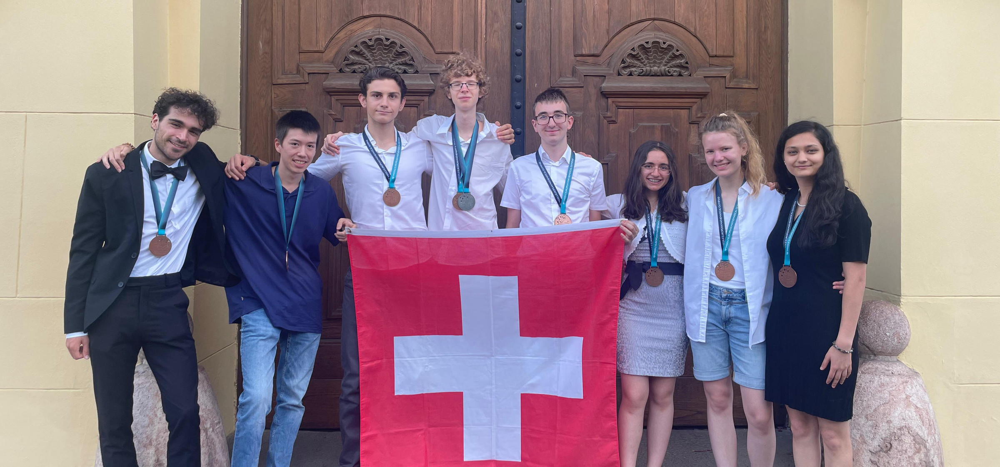

I am the **Academic Director** of the [Swiss Mathematical Olympiad](https://mathematical.olympiad.ch/en/),
an annual, national mathematics competition for high school students. The primary purpose of the competition is to select the Swiss
delegation for the [International Mathematical Olympiad](https://www.imo-official.org/) (IMO)
and the [Middle European Mathematical Olympiad](https://www.memo-official.org/MEMO/contests/previous/) (MEMO).
We are part of a larger network of [Swiss Science Olympiads](https://science.olympiad.ch/en/).

Our agenda includes several rounds of competition, numerous preparation meetings, a training weekend,
and a week-long camp for finalists, followed by many more events for those who qualify for international events.
The topics covered differ vastly from the school curriculum, focusing on logical thinking, creative problem-solving,
and proof-writing. Every year, the Olympiad provides a platform for young people from all over Switzerland to interact
and compete with like-minded peers, all while learning new mathematics.
Our problems, results and teaching material can be found on our [archive](https://imosuisse.github.io).

As volunteers, we create, supervise and correct exams, write teaching material,
organise and implement training camps, and lead the best students to international competitions every year.
One of my main contributions is the creation of [original problems](/portfolio.html).
I have also authored some problems for international competitions, including MEMO, OFM, and IMO.

<figure>
    
    <figcaption>Figure 1: Leading the Swiss Team to glory at MEMO 2024</figcaption>
</figure>

### Roles at International Olympiads
I've been involved at many international mathematics competitions and plan to attend many more.
- **Coordinator** at MEMO 2026 in Slovenia
- **Coordinator\*** at the Olympiade Francophone de Mathématiques 2026
- **Team Leader Liechtenstein** at the IMO 2025 in Australia
- **Coordinator\*** at the Pan African Mathematics Olympiad 2024
- **Team Leader Switzerland** at MEMO 2024 in Hungary
- **Coordinator** at IMO 2024 in England
- **Team Leader Liechtenstein** at the IMO 2023 in Japan
- **Coordinator** at the European Girls' Mathematical Olympiad 2023 in Slovenia
- **Coordinator** at MEMO 2022 in Switzerland
- **Problem Selection Committee** at MEMO 2022 in Switzerland
- **Team Leader Liechtenstein** at IMO 2022 in Norway
- **Team Leader Liechtenstein\*** at IMO 2021
- **Coordinator\*** at the Olympiade Francophone de Mathématiques 2021
- **Deputy Leader Switzerland\*** at MEMO 2020
- **Team Leader Switzerland\*** at the Cyberspace Mathematical Competition 2020
- **Main Organiser\*** of the Global Quarantine Mathematical Olympiad 2020

**\*** remote participation

I have also been involved in many international training events, giving lectures to IMO delegations from Switzerland,
Liechtenstein, Austria, Germany, Slovenia, Costa Rica and Kenya.

### Awards

During my high school days, I myself participated very successfully in many mathematical competitions. 
To date, I am one of only two people holding three gold medals from the Swiss Mathematical Olympiad.
- **Bronze Medal** (73%) at IMO 2019 in England
- **Gold Medal** at the Swiss Mathematical Olympiad 2019
- **Bronze Medal** (68%) at IMO 2018 in Romania
- **Silver Medal** at the Benelux Mathematical Olympiad 2018 in Luxembourg
- **Gold Medal** at the Swiss Mathematical Kangaroo Contest 2018
- **Gold Medal** at the Swiss Mathematical Olympiad 2018
- **Honourable Mention** (32%) at IMO 2017 in Brazil
- **Gold Medal** at the Swiss Mathematical Kangaroo Contest 2017
- **Gold Medal** at the Swiss Mathematical Olympiad 2017
- **Gold Medal** at the Swiss PANGEA Mathematical Contest 2016
- **Gold Medal** at the Swiss PANGEA Mathematical Contest 2015

A detailed breakdown of my performance at IMO can be found on
[imo-official](https://www.imo-official.org/participant_r.aspx?id=27554),
and my national achievements are found on 
[imosuisse.github.io](https://imosuisse.github.io/participants/valentin-imbach) and in the 
[Hall of Fame](https://imosuisse.github.io/hall-of-fame).

In 2017 already, my team and I were awarded for **Best Swiss Team Achievement** for our performance at IMO.
In both 2018 and 2019, I was given the award for **Best Swiss Interdisciplinary Achievement** by the association
Swiss Science Olympiads. 

<figure>
    
    <figcaption>Figure 1: Almost Gold</figcaption>
</figure>

I also participated in some other science Olympiads, including
the [International Olympiad in Informatics](https://ioinformatics.org/) (IOI).
- **Participation** (21%) at IOI 2019 in Azerbaijan
- **Gold Medal** at the Swiss Olympiad in Informatics 2019
- **Bronze Medal** at the Swiss Philosophy Olympiad 2019
- **Participation** (31%) at IOI 2018 in Japan
- **Silver Medal** at the Swiss Olympiad in Informatics 2018

