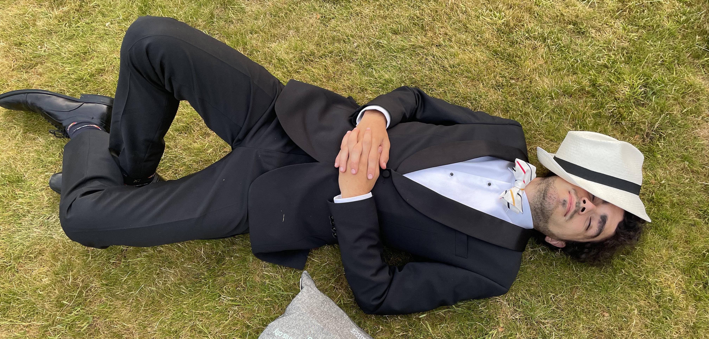

My main research interests lie in the interplay between mathematical
foundations and computation theory. The fields I am enthusiastic about include complexity theory,
computability theory, automata and formal language theory and logic.

I am part of [Theory Lab 5](https://theory.epfl.ch) at EDIC, the computer science department of EPFL,
where I am a doctoral candidate under [Mika Göös](https://ic-people.epfl.ch/~goos). My group works on subfields of complexity theory,
currently with a focus on communication complexity, proof complexity, query complexity and TFNP theory.

### Publications

1. [**Sign-Rank of k-Hamming Distance is Constant**](https://eccc.weizmann.ac.il/report/2025/060) (2025, preprint)\
with Mika Göös, Nathan Harms and Dmitry Sokolov

<figure>
    
    <figcaption>Figure 1: Thinking in Hat</figcaption>
</figure>

### Other Research Interests

Some other research areas that fascinate me include
- Reverse Mathematics and new foundations
- Non-standard Analysis
- Large Cardinal Axioms
- Automated Theory Proving and Computer Formalisation
- Tiling Problems

I am loosely affiliated with a research effort led by Timothy Gowers on [Human Oriented Automated Theorem Proving](https://wtgowers.github.io/human-style-atp/)

<!-- ## Recreational Projects

- Tiling Potential
- Hyper-Continued fractions -->

