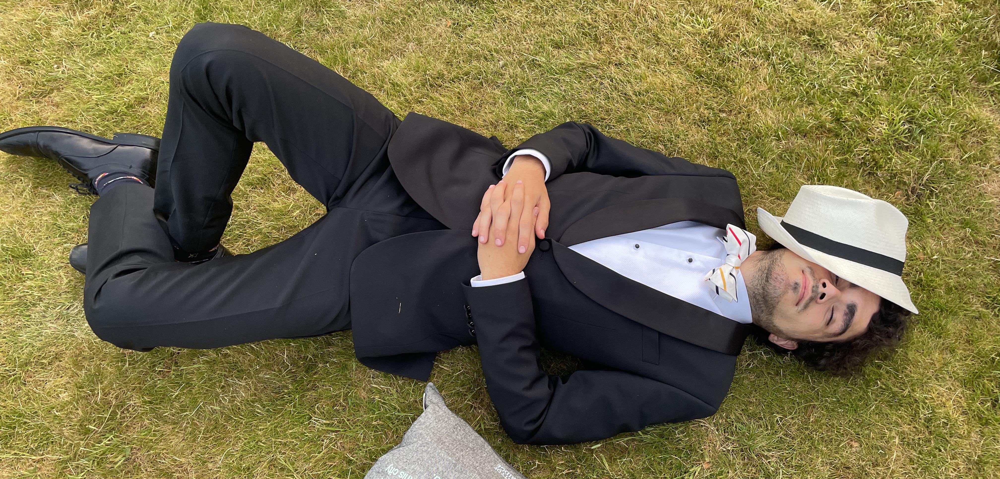

I am part of [Theory Lab 5](https://theory.epfl.ch) at [EDIC](https://www.epfl.ch/schools/ic/),
the computer science department of [EPFL](https://www.epfl.ch/en/),
where I am a doctoral candidate under [Mika Göös](https://ic-people.epfl.ch/~goos).
Our group works on concrete complexity theory, where we ask things like

- **Query Complexity:** *How many questions does one need to ask to determine ... ?*
- **Communication Complexity:** *How much talking is required to jointly solve ... ?*
- **Circuit Complexity:** *How small is the smallest machine that computes ... ?*
- **Proof Complexity:** *How long is the shortest proof of ... ?*

At the moment, I am specifically interested in the interaction of
**constant-cost communication complexity** with **algebraic circuit complexity**.

As a founding member of the [Association for Human Mathematics](ahmaths.org),
I have pledged to no use large language models in any core research capacity.

### Publications

1. **Sign-Rank of k-Hamming Distance is Constant** (FOCS 2025)\
with Mika Göös, Nathan Harms, and Dmitry Sokolov.\
[arχiv](https://arxiv.org/abs/2506.12022),
[ECCC](https://eccc.weizmann.ac.il/report/2025/060),
[slides](/downloads/focs-2025.pdf)\
-----------------------------------------------------\
**In a nutshell:** *Two ants on a cube can determine if they are very close to each other
using way less communication than was previously believed.*

2. **Algebraic Complexity Approach to Sign-Rank** (pre-print)\
with Mika Göös, Kaave Hosseini, and Anastasia Sofronova.\
<!-- [arχiv](https://arxiv.org/abs/2506.12022), -->
[ECCC](https://eccc.weizmann.ac.il/report/2026/193/),
<!-- [slides](/downloads/focs-2025.pdf)\ -->
-----------------------------------------------------\
**In a nutshell:** *In a particular algebraic setting, deciding whether two patterns
combine to form a rectangle requires a lot of communication.*

More information can be found on my [Google Scholar](https://scholar.google.com/citations?user=yVZWjtgAAAAJ&hl=en) page.

<figure>
    
    <figcaption>Figure 1: Thinking in Hat</figcaption>
</figure>

### Talks

1. **Communication and Topology** (2026)
"5 minute talk" from *Complexity as a Kaleidoscope 2026*\
[YouTube](https://youtu.be/qV4VLNXoH0I?t=784)

### Once Upon a Time

1. **Transfinite Context-Free Generative Grammars** (2022)\
Cambridge Mathematical Tripos Part III Essay\
[pdf](/downloads/essay.pdf)\
-----------------------------------------------------\
**In a nutshell:** *A certain classical characterisation of languages
can be generalised to languages with words of infinite length*

2. **On the Probabilistic Method and Permutations** (2019)\
High School Graduation Project\
[pdf](/downloads/matura.pdf), [poster](/downloads/matura-poster.pdf)\
-----------------------------------------------------\
**In a nutshell:** *It is surprisingly useful to use randomness in the proofs of
statements that are entirely deterministic.*

### Other Research Interests

- Reverse mathematics & new foundations
- Model theory & non-standard analysis
- Large cardinal axioms & incompleteness
- Computer formalisation & automated theorem proving

I am also loosely affiliated with a research effort led by Timothy Gowers
on [Human Oriented Automated Theorem Proving](https://wtgowers.github.io/human-style-atp/)

<!-- ## Recreational Projects

- Tiling Potential
- Hyper-Continued fractions -->

