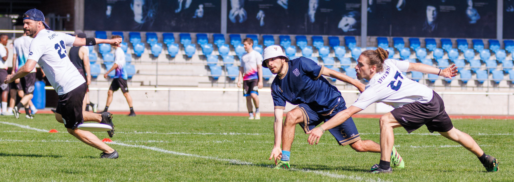

### Ultimate
At the beginning of my bachelor's studies in Cambridge I discovered the sport of Ultimate, a dynamic teamsport played with a flying disc (more commonly known as a frisbee). Ultimate is a non-contact sport, maximising the technical and tactical aspects and allowing play with mixed-genered teams. There was a lot of Ultmate to be played in Cambridge where many Colleges, the Univerity and the town each had their own clubs. Starting out at the Trinity College Ultimate Club, I quickly improved and soon after made it onto the Univerity team. Spending my long sommer breaks back home in Switzerland, I also joined the club in Zürich where I played until I moved to Lausanne for my PhD, joining the Lausanne club soon after.

<figure>
    
    <figcaption>Figure 1: Throwing in Hat</figcaption>
</figure>

- Since 2024: Swiss National Team, Elite Open
- Since 2024: Lausanne Ultimate Club "FlyHigh"
    - Captain of the Open Team *Løsanson*
- Since 2022: Zürich Ultimate
	- Board Member for Spirit of the Game
	- First Open Team *platZHirsch*
	- Second Mixed Team *ZebraH* (Captaincy 2024)
	- Participation at World Beach Ultimate Club Champianships
	- Participation in the European Season
	- Bronze Medal at Swiss Open Beach Nationals 2024
	- Bronze Medal at Swiss Mixed Beach Nationals 2023
	- Participation at Missulldisc 2024, Paganello 2024, Südseecup 2023/24
- Since 2021: Cambridge Ultimate *CUlt*
- Since 2020: Cambridge University Ultimate Club *Strange Blue*
	- First Open Team (Captaincy 2023)
	- First Mixed Team
	- Silver Medal at UK Open University Outdoor Nationals 2023 (2nd division)
	- Gold Medal at UK Open University Outdoor Nationals 2022 (3rd division)
	- Gold Medal at UK Open University Indoor Regionals 2022
- Since 2019: Trinity College Ultimate Club
	- First Place at Indoor Cuppers 2021
	- Captaincy (2020 - 2022)

### Climbing
Anther sport I took up during my undergrad days is climbing, indoor boudlering in particular. I was captain of the Trinity College Climbing Club and a member of the Cambridge Univeristy Mounteneering Club. I still boulder occasionally, currently around the 6B+ level.

### Rowing
In my first year at Cambridge, I rowed for the Trinity Rowing Club *First and Thirds*.
- First Place at the Talbott Cup.

### Running
I enjoy both long and short distance running, mainly as training for Ultimate.
- Nov 2024: Basler Stadtlauf, 5500m, 25:17
