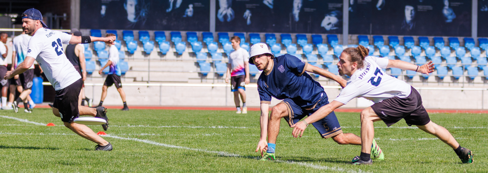

### Ultimate
At the beginning of my undergrad I discovered the sport of Ultimate, a dynamic team sport played with a flying disc
(more commonly known as a Frisbee). Being a non-contact sport, it maximising the technical and tactical aspects
and allows for play with mixed-gendered teams. Over the years I have participated in many [competitions](/tournaments.html),
for a number of different clubs and teams.

<figure>
    
    <figcaption>Figure 1: Throwing in Hat</figcaption>
</figure>

- Since 2026: Coach at *Servies des Sports UNIL/EPFL*
- Since 2025: Regional Team *Jurassic Pack*
    - EUCS Tours and Windmill 2026 (Captaincy)
- Since 2024: Swiss National Team
    - Elite Open Grass
    - Elite Mixed Indoors (Captaincy at EUIC 2026)
- Since 2024: Lausanne Ultimate Club *FlyHigh*
    - Open Team *Løsanson* (Captaincy 2026)
        - EUCS 2025
    - Mixed Team
- Since 2022: Zürich Ultimate
	- Board Member for Spirit
    - Open Team *platZHirsch*
        - WBUCC 2024, EUCS 2024, EBUCC 2025
	    - Bronze at Swiss Beach Nationals 2024
	- Mixed Team *ZebraH* (Captaincy 2024)
	    - Bronze at Swiss Beach Nationals 2023
- 2021 - 2023: Cambridge Ultimate *CUlt*
    - Open Team
- 2020 - 2023: Cambridge University Ultimate Club *Strange Blue*
	- Open Team (Captaincy 2023)
        - Silver at UK University Outdoor Nationals 2023 (2nd division)
        - Gold at UK University Outdoor Nationals 2022 (3rd division)
        - Gold at UK University Indoor Regionals 2022
    - Mixed Team
    - Many Varsity Wins against Oxford
- 2019 - 2023: Trinity College Ultimate Club
	- Captaincy in 2020, 2021 and 2022
	- Gold at Indoor Cuppers 2021

I am a certified ultimate coach by the Swiss ultimate association and
have coached several mixed and open teams across all levels.
To further popularise the sport, I have led numerous workshops at schools,
as well as outreach events for organisations including
- GORILLA Schweiz
- fit4future
- Panathlon Family Games Lausanne
- Stiftung für Junge Auslandschweizer

On occasion, I have appeared as a guest commentator on [ulty.tv](https://www.ulti.tv/) alongside Stefan Rappazzo:
- Swiss Mixed Nationals 2026 – 9th place game: [AIR vs FAB X](https://www.youtube.com/watch?v=ywPi9GbJaoY)
- Swiss Mixed Nationals 2025 – Semi Final: [Scorillaz vs FSL](https://www.youtube.com/watch?v=3WI_MKn3nQs)
- Swiss Mixed Nationals 2025 – 5th place game: [FlyHigh vs FABrique](https://www.youtube.com/watch?v=ep_FPJBwV5c)

### Other Sports

I was captain of the *Trinity College Climbing Club* and member of the *Cambridge University Mountaineering Club*.
I mostly boulder indoors, around the **6C** level.

I briefly rowed for the Trinity College Rowing Club *First and Thirds*,
winning a gold medal at the **Talbott Cup 2020**.

I enjoy both long and short distance running.
<!-- (Basler Stadtlauf 2024, 5500m, 25:17). -->

I play casual chess online, mostly with short time controls, around the **2000 ELO** level.

In high school I dabbled in speed cubing, with my [official](https://www.worldcubeassociation.org/persons/2015IMBA01)
personal best at **29.22 Seconds** for the 3x3 cube, from Swiss Nationals 2015.
